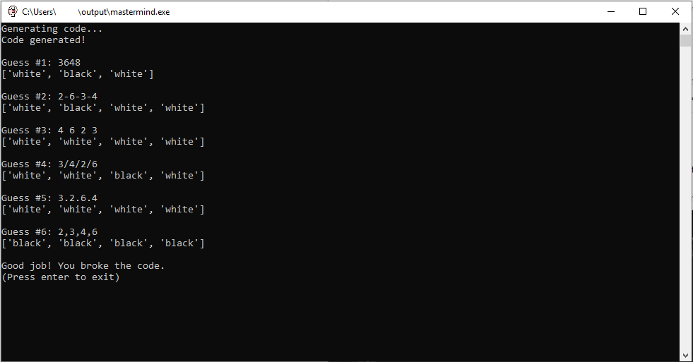
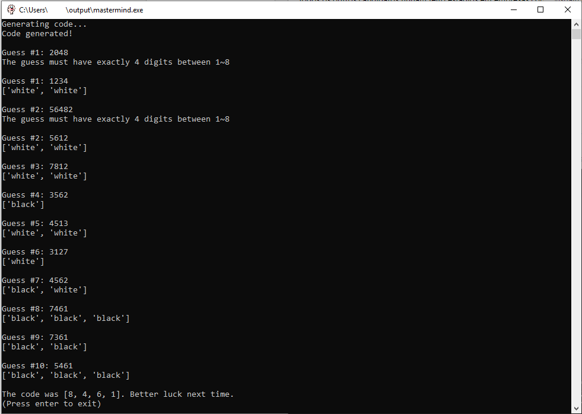
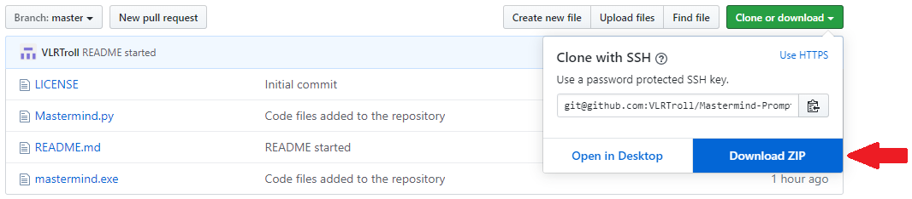
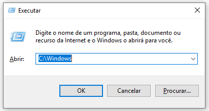
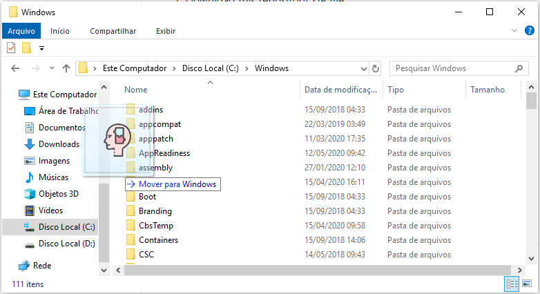
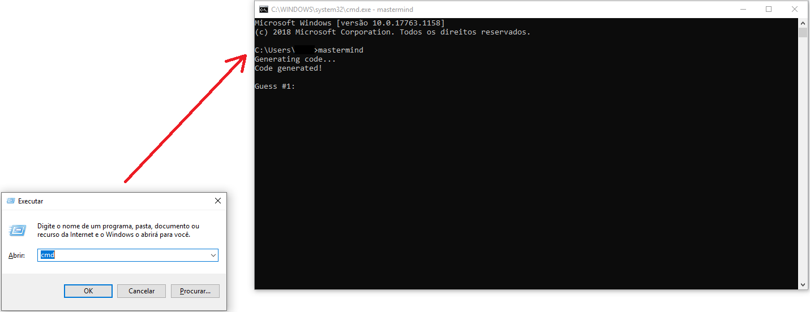

# Mastermind-Prompt-Game

A implementation of Mastermind game to the command line.

   
  <b>Some input formats accepted</b>

   
  <b>Input validation</b>

  

## Rules
1. Each color is represented by only one digit, so the game can have 9 colors at most (0 not allowed).
1. The code don't contains color repetition.
1. Each guess must have exactly k numeric digits, where k is the size of the code (Default code size is 4).

## Customization
You can custom the following properties:
  - <b>Number of colors:</b> 5 to 9 colors (default is 8)
  - <b>Code size:</b> 1 to (<n_colors> - 1). (default is 4)
  - <b>Number of tries:</b> 1 at least. (default is 10)

## Including the game into your terminal (Windows)
1. Download this repository ZIP file

  

  

1. Press <b>Windows+R</b>, type <b>C:\Windows</b> and press <b>Enter</b>.

  

1. Put the <b>.exe</b> file (inside of the ZIP) in the current directory.

  

1. Open the terminal and type "<b>mastermind</b>". Press <b>Enter</b>.

  

## See more
### How to convert .py to .exe? (Step by step guide)
https://dev.to/eshleron/how-to-convert-py-to-exe-step-by-step-guide-3cfi
